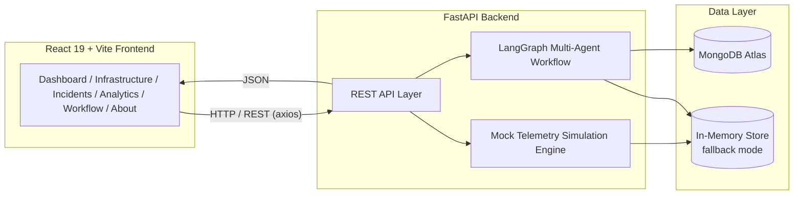
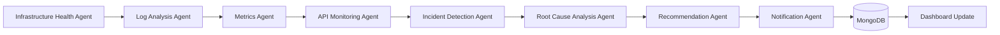

# 🛡️ GuardianOps AI

[](https://guardian-ops-ai-ten.vercel.app)
[](https://guardianops-ai.onrender.com/docs)
[](https://guardianops-ai.onrender.com)
[](LICENSE)

**AI-Powered Multi-Agent Digital Infrastructure Monitoring & Incident Intelligence Platform**

GuardianOps AI is a full-stack, enterprise-grade **AIOps platform** designed to monitor infrastructure, analyze operational data, detect incidents, and provide AI-powered operational insights in real time.

The platform combines **real system monitoring**, **application log analysis**, **LangGraph multi-agent workflows**, and an interactive dashboard to help operators identify issues, perform root cause analysis, and receive intelligent remediation recommendations from a single interface.

It supports both **live infrastructure telemetry** through the standalone **Guardian Agent** and simulated enterprise environments for demonstration, development, and testing.

Access is secured using **JWT authentication**, providing a single-operator management console similar to modern enterprise AIOps platforms.

---

## 🌐 Live Deployment

| Service | URL |
|---------|-----|
| **Live Application** | https://guardian-ops-ai-ten.vercel.app |
| **Backend API** | https://guardianops-ai.onrender.com |
| **Swagger API Documentation** | https://guardianops-ai.onrender.com/docs |
| **GitHub Repository** | https://github.com/Bharath-buoy/GuardianOps-AI |

---

## ✨ Highlights

- **Modern dark enterprise UI** inspired by IBM Instana, Datadog, Dynatrace, Grafana & Azure Portal
- **8 specialized AI agents** orchestrated end-to-end with **LangGraph**, now driven by real
  system metrics and real application logs (in addition to the original simulated telemetry)
- **Real system monitoring** via `psutil` — CPU, RAM, disk, network throughput, running
  processes, and system uptime, folded into the same infrastructure schema as every other service
- **Real-time log monitoring** via `watchdog` — tails `application.log` / `app.log` /
  `server.log` / `*.jsonl` files the moment new lines are written, no manual upload
- **Structured log parser** — extracts timestamp, service, severity, message, and multi-line
  stack traces from both plain-text and JSON log formats
- **Automatic incident detection** from real signals — high CPU/RAM/disk/network, high response
  time, database timeouts, connection failures, frequent exceptions, memory-leak indicators
- **Dynamic AI recommendations** computed from the actual observed numbers (not hardcoded
  templates) — severity and suggested scale-out both grow with how far over threshold a signal is
- **JWT authentication** — single-operator register/login, bcrypt password hashing, protected
  API routes and protected React routes
- **30-second AIOps scheduler** — runs the full LangGraph workflow automatically, on top of the
  original manual "Run Workflow" trigger and the mock telemetry simulation loop
- **4 sample applications** (`sample_apps/`) that continuously write realistic logs so the
  platform has real log files to monitor out of the box
- **Guardian Agent** (`/guardian-agent`) — a lightweight, standalone Python agent you can install
  on any remote machine; it reports real psutil metrics and tailed application logs back to
  GuardianOps AI over a REST API, authenticated with an API key. Multiple agents are supported
  simultaneously, and their telemetry flows into the same LangGraph pipeline automatically
- **Live workflow visualization** using **React Flow**, animated node-by-node as agents execute
- **MongoDB Atlas integration** with automatic graceful fallback to in-memory mock mode if unset
- **Full REST API** documented via FastAPI's built-in Swagger UI (`/docs`)

---

## 🖥️ Application Pages

| Page | Description |
|---|---|
| **Login / Register** | JWT-based sign-in; single operator account (register is disabled once one exists) |
| **Dashboard** | Infrastructure health score, KPIs, recent incidents, AI workflow status, recent activity |
| **Infrastructure** | Full service inventory — APIs, microservices, databases, containers, caches, queues, plus the real `host-system` entry populated by psutil |
| **Incidents** | Incident timeline with AI summary, root cause analysis, recommendations, severity — includes incidents detected from real metrics/logs |
| **Analytics** | Response time / CPU / RAM / error-rate trends, incident trends, top failing services |
| **Workflow** | Live LangGraph multi-agent pipeline visualization (React Flow) with run history |
| **About** | Architecture overview, tech stack, SDG alignment |

---

## 🏗️ Architecture



### LangGraph Agent Pipeline



Each agent is a LangGraph node operating over a shared typed state object. The pipeline is
deterministic and rule-based by default (so it runs with **zero API keys**), but each agent's
`_narrate()` hook is a clean extension point for wiring in a real LLM call via LangChain when
`USE_LLM=true` and an API key is supplied.

---

## 🧰 Tech Stack

| Layer | Technologies |
|---|---|
| **Frontend** | React 19, Vite, JavaScript, Tailwind CSS v4, React Router DOM, Framer Motion, Axios, React Icons, Lucide React, Recharts, React Hot Toast, React Flow |
| **Backend** | FastAPI, Python 3.12, LangGraph, LangChain, Motor, Pydantic, httpx, psutil, watchdog, bcrypt, PyJWT, Uvicorn |
| **Database** | MongoDB Atlas (with automatic in-memory fallback) |
| **Deployment** | Vercel (frontend) + Render (backend) |

---

## 📁 Folder Structure

```
guardianops-ai/
├── backend/
│   ├── app/
│   │   ├── main.py                 # FastAPI entrypoint (auth, live monitoring wiring)
│   │   ├── core/
│   │   │   ├── config.py           # Settings via pydantic-settings
│   │   │   ├── database.py         # MongoDB Atlas connection (Motor)
│   │   │   ├── security.py         # bcrypt hashing + JWT create/decode
│   │   │   └── deps.py             # get_current_user dependency for protected routes
│   │   ├── models/                 # Pydantic schemas
│   │   │   ├── service.py
│   │   │   ├── incident.py
│   │   │   ├── workflow.py
│   │   │   └── user.py             # Register/Login/TokenResponse schemas
│   │   ├── routers/                # REST API endpoints
│   │   │   ├── auth.py             # /auth/register, /auth/login, /auth/me, /auth/status
│   │   │   ├── dashboard.py
│   │   │   ├── infrastructure.py
│   │   │   ├── incidents.py
│   │   │   ├── analytics.py
│   │   │   ├── analyze.py
│   │   │   ├── workflow.py
│   │   │   ├── metrics.py          # Real psutil system metrics
│   │   │   ├── logs.py             # Cross-service log query
│   │   │   └── recommendations.py  # AI recommendation feed
│   │   ├── agents/                 # LangGraph multi-agent workflow
│   │   │   ├── state.py            # Shared AgentState schema + AGENT_SEQUENCE
│   │   │   ├── nodes.py            # 8 agent implementations (real + simulated paths)
│   │   │   └── graph.py            # StateGraph wiring + execution
│   │   └── services/
│   │       ├── mock_data.py            # Mock telemetry generator + live-data store extensions
│   │       ├── system_monitor.py        # Real psutil metrics collector
│   │       ├── log_parser.py            # Structured log line/stack-trace parser
│   │       ├── log_watcher.py           # watchdog-based real-time log tailing
│   │       ├── incident_rules.py        # Threshold/pattern-based real incident detection
│   │       ├── recommendation_engine.py # Dynamic (non-hardcoded) recommendation text
│   │       ├── scheduler.py             # Runs the LangGraph workflow every 30s
│   │       ├── persistence.py           # MongoDB write-through helpers
│   │       └── user_service.py          # Single-operator account service
│   ├── sample_apps/                 # 4 tiny apps that write realistic logs continuously
│   │   ├── common.py
│   │   ├── authentication_service.py
│   │   ├── payment_service.py
│   │   ├── inventory_service.py
│   │   ├── notification_service.py
│   │   └── run_all.py               # Launches all four together
│   ├── requirements.txt
│   └── .env.example
│
├── frontend/
│   ├── src/
│   │   ├── main.jsx
│   │   ├── App.jsx                  # Routes, wrapped in AuthProvider + ProtectedRoute
│   │   ├── context/AuthContext.jsx  # JWT session state, login/register/logout
│   │   ├── pages/                   # Login, Register, Dashboard, Infrastructure, Incidents, Analytics, Workflow, About
│   │   ├── components/
│   │   │   ├── auth/                # ProtectedRoute
│   │   │   ├── layout/              # Sidebar, Topbar (incl. logout), AppLayout
│   │   │   ├── common/              # Card, StatusBadge, Skeleton
│   │   │   ├── dashboard/           # KpiCard, HealthScoreGauge, Charts
│   │   │   ├── infrastructure/      # ServiceCard, ServiceDetailDrawer
│   │   │   ├── incidents/           # IncidentCard
│   │   │   └── workflow/            # AgentNode (React Flow custom node)
│   │   ├── services/api.js         # Axios client, JWT attach/401 handling, typed endpoint map
│   │   ├── hooks/usePolling.js      # Live-refresh data hook
│   │   ├── utils/format.js         # Formatting + status/severity color maps
│   │   └── styles/index.css        # Tailwind v4 + design tokens
│   ├── package.json
│   ├── vite.config.js
│   ├── postcss.config.js
│   └── .env.example
│
├── guardian-agent/                  # Standalone telemetry agent (install on any machine)
│   ├── agent.py                     # Main entrypoint — config, send loop
│   ├── collector.py                 # psutil metrics collection
│   ├── watcher.py                   # watchdog-based log file tailing
│   ├── requirements.txt
│   ├── config.json
│   └── README.md                    # Install + connection guide
│
└── docs/
    └── API.md                      # Full REST API reference
```

---

## 🚀 Getting Started

### Prerequisites

- Node.js ≥ 18
- Python ≥ 3.10 (3.12 recommended)
- (Optional) A free [MongoDB Atlas](https://www.mongodb.com/cloud/atlas) cluster

### 1. Backend

```bash
cd backend
python -m venv venv
source venv/bin/activate        # Windows: venv\Scripts\activate
pip install -r requirements.txt
cp .env.example .env            # edit MONGODB_URI if you have one — optional!
uvicorn app.main:app --reload
```

The API will be live at **http://localhost:8000** — interactive docs at **http://localhost:8000/docs**.

> 💡 **No MongoDB? No problem.** GuardianOps AI automatically detects if `MONGODB_URI` is
> unreachable and transparently falls back to a rich in-memory simulation, so the app always boots
> and demos successfully.

### 2. Sample applications (optional, but recommended)

In a separate terminal, launch the four sample apps so GuardianOps AI has real, continuously
updating log files to monitor:

```bash
cd backend/sample_apps
python run_all.py
```

Each writes realistic log lines (including occasional errors and stack traces) to its own file
under `backend/sample_apps/logs/`. GuardianOps AI's `watchdog`-based log watcher picks these up
in real time — no manual upload needed.

### 3. Frontend

```bash
cd frontend
npm install
cp .env.example .env             # optional — defaults to the Vite dev proxy
npm run dev
```

Open **http://localhost:5173** in your browser. You'll land on **/login** — register the single
operator account on first run, then sign in.

### 4. Guardian Agent (optional — monitor a remote machine)

To monitor a machine other than the one running the backend, install the standalone Guardian
Agent there instead of (or alongside) the sample apps:

```bash
cd guardian-agent
pip install -r requirements.txt
# edit config.json: set server_url to your backend's address and api_key to
# match AGENT_API_KEY in backend/.env
python agent.py
```

See **`guardian-agent/README.md`** for full installation, connection, and troubleshooting
instructions, including running it as a background service. Multiple agents on different
machines are supported simultaneously — each shows up as its own service on the Infrastructure
page and feeds the same LangGraph pipeline automatically.

---

## 🔌 REST API Reference

| Method | Endpoint | Description |
|---|---|---|
| `POST` | `/api/auth/register` | Register the (single) operator account — 409 if one already exists |
| `POST` | `/api/auth/login` | Sign in, returns a JWT access token |
| `GET` | `/api/auth/me` | Current authenticated user (requires JWT) |
| `GET` | `/api/auth/status` | Whether an account already exists (used by the Register page) |
| `GET` | `/api/dashboard` | Aggregated dashboard KPIs, health score, recent incidents & activity |
| `GET` | `/api/infrastructure` | Full service inventory with optional `type` / `status` filters |
| `GET` | `/api/infrastructure/{service_id}` | Single service detail + metrics history + recent logs |
| `GET` | `/api/incidents` | Incident list with optional `status` / `severity` filters |
| `GET` | `/api/incidents/{incident_id}` | Single incident detail + recommendation |
| `GET` | `/api/analytics` | Trend series for charts (latency, CPU, RAM, errors, incidents, availability) |
| `POST` | `/api/analyze` | On-demand single-service risk analysis |
| `POST` | `/api/workflow/run` | Triggers a full LangGraph multi-agent workflow run |
| `GET` | `/api/workflow/nodes` | Static node/edge graph definition (for the React Flow diagram) |
| `GET` | `/api/workflow/history` | Recent workflow run history |
| `GET` | `/api/metrics` | Real-time psutil system snapshot (CPU, RAM, disk, network, processes, uptime) |
| `GET` | `/api/metrics/history` | Recent historical system metric snapshots |
| `GET` | `/api/metrics/services/{service_id}` | Time-series metrics for a single service (real or simulated) |
| `GET` | `/api/logs` | Cross-service log query with optional `service_id` / `level` filters |
| `GET` | `/api/recommendations` | AI recommendation feed, most recent first |
| `GET` | `/api/agents` | List registered Guardian Agents with live/offline status (requires JWT) |
| `POST` | `/api/agents/telemetry` | Guardian Agent telemetry ingestion (requires `X-Agent-Api-Key`, not a user JWT) |
| `GET` | `/api/health` | Service health check + MongoDB connection status |

Every endpoint above except `/auth/*`, `/agents/telemetry`, and `/health` requires a valid JWT
(`Authorization: Bearer <token>`), obtained from `/auth/login` or `/auth/register`.
`/agents/telemetry` instead requires the `X-Agent-Api-Key` header to match `AGENT_API_KEY` — see
`guardian-agent/README.md`.

Full request/response schemas are available live at `/docs` (Swagger UI) once the backend is running.

---

## 🗃️ MongoDB Collections


| Collection | Purpose |
|---|---|
| `users` | The single operator account (bcrypt-hashed password) |
| `services` | Infrastructure inventory (APIs, microservices, DBs, containers, caches, queues) |
| `incidents` | Detected incidents with AI summary, root cause, recommendation, timeline |
| `metrics` | Time-series CPU / RAM / latency / error-rate data points per service |
| `logs` | Structured application log lines per service |
| `workflow_runs` | LangGraph execution history — per-agent steps, durations, outcomes |
| `recommendations` | AI-generated remediation actions linked to incidents |
| `agents` | Registered Guardian Agents — agent ID, hostname, OS, last-seen timestamp |

---

## 🤖 The 8 AI Agents

Each agent operates on **both** real data (psutil metrics, watched application logs) and the
original simulated telemetry, so the platform works identically whether or not any sample apps
or MongoDB are configured.

1. **Infrastructure Health Agent** — computes the fleet-wide health score; folds a real psutil
   snapshot into the store as a `host-system` service before scoring
2. **Log Analysis Agent** — scans logs for error/warning patterns, including real-log pattern
   hits (DB timeout, connection failure, memory-leak indicators)
3. **Metrics Agent** — flags high CPU/RAM and latency anomalies across real and simulated services
4. **API Monitoring Agent** — checks API/microservice SLO compliance
5. **Incident Detection Agent** — creates incidents from real threshold/pattern breaches (with
   deduplication against still-open incidents) and from at-risk simulated services
6. **Root Cause Analysis Agent** — correlates signals into a root cause hypothesis
7. **Recommendation Agent** — produces actionable remediation steps computed from the actual
   observed numbers (`recommendation_engine.py`) rather than fixed template text
8. **Notification Agent** — dispatches alerts to the dashboard feed

---


# 👨‍💻 Author

**Bharath N**

Master of Computer Applications  
St. Claret College, Bengaluru

- 🌐 GitHub: https://github.com/Bharath-buoy
- 💼 LinkedIn: https://www.linkedin.com/in/bharath-n-489360245/
- 🚀 Project: GuardianOps AI
---

## 🎯 Project Purpose

GuardianOps AI is a production-inspired AIOps platform built to demonstrate modern infrastructure monitoring, AI-powered incident detection, and intelligent operational insights.

The project showcases enterprise software architecture by combining real-time telemetry collection, multi-agent AI workflows, cloud-native backend services, and an interactive monitoring dashboard.

## 🌟 Key Highlights

- Real-time infrastructure monitoring
- Standalone Guardian Agent for remote machine telemetry
- AI-powered incident detection and root cause analysis
- LangGraph multi-agent workflow orchestration
- Secure JWT authentication
- MongoDB Atlas cloud persistence
- Modern React dashboard with FastAPI backend

---
## 📄 License

MIT — free to use, modify, and build upon for educational and portfolio purposes.
